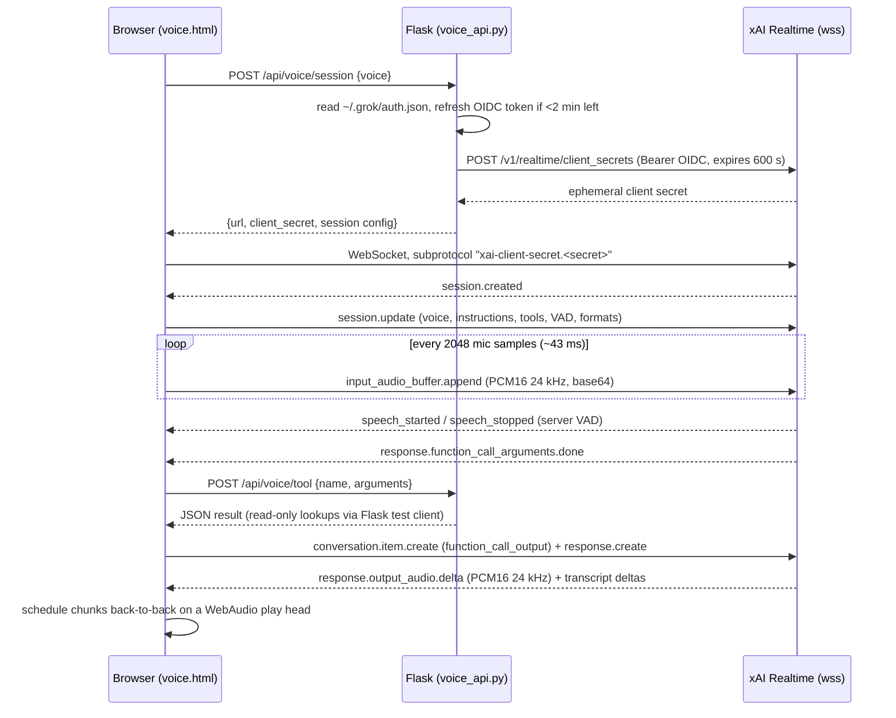

# How the WBN voice agent works

Source of truth: `voice_api.py` (server) and `templates/voice.html` (browser).
Stack: Flask + vanilla JS in the browser, xAI Realtime API (`grok-voice-latest`)
for speech-to-speech. No third-party audio library, no server-side audio.



## 1. Auth: subscription OAuth, never an API key in the page

- The owner's Grok subscription token lives in `~/.grok/auth.json` (written by
  `grok login`). It is an OIDC JWT that expires roughly every 20 minutes and
  comes with a `refresh_token` and `oidc_client_id`.
- `xai_bearer()` reads that file, decodes the JWT `exp`, and if fewer than
  120 s remain it POSTs `grant_type=refresh_token` to
  `https://auth.x.ai/oauth2/token` (tries JSON body first, then form-encoded).
  The refreshed token is cached **in memory only**, under a lock. The file is
  never rewritten.
- `XAI_API_KEY` env var takes priority if set (we don't use it: the pasted key
  had no credit).
- The browser never sees the OIDC token. `/api/voice/session` exchanges it for
  an **ephemeral client secret** (`POST /v1/realtime/client_secrets`,
  `expires_after: 600 s`). The page opens the WebSocket with that secret in the
  subprotocol header: `new WebSocket(url, ['xai-client-secret.' + secret])`.
  So a session must be started within 10 min of minting, and the secret is
  useless after that.

## 2. Session config (what the server hands the browser to send in `session.update`)

```json
{
  "voice": "rigel",
  "instructions": "<system prompt, see section 6>",
  "turn_detection": {"type": "server_vad", "silence_duration_ms": 700},
  "tools": [ ...5 function tools... ],
  "audio": {
    "input":  {"format": {"type": "audio/pcm", "rate": 24000},
               "transcription": {"language_hint": "en", "keyterms": [...]}},
    "output": {"format": {"type": "audio/pcm", "rate": 24000}}
  },
  "replace": {"FeNi": "Fenny", "LIM": "lim", "LD": "L D", "DT": "D T", "POS": "poss", ...}
}
```

Notes:
- `voice` is validated server-side with `[a-z0-9]{2,16}`, default `rigel`.
- `keyterms` bias the speech recogniser toward domain words (pit names,
  weighbridge IDs, scenario numbers). This fixed "four point two point one"
  being heard as random digits.
- `replace` is a pronunciation map for the TTS side so acronyms are spoken the
  way planners say them.

## 3. How it listens

**It listens continuously, for as long as the session is open.** There is no
push-to-talk and no fixed listening window. Turn-taking is done by xAI's
server-side voice activity detection (`server_vad`).

Browser side, in order:
1. `getUserMedia({audio:{channelCount:1, sampleRate:24000, echoCancellation:true, noiseSuppression:true}})`.
2. An `AudioContext` at 24 kHz, a `ScriptProcessorNode` with a 2048-sample
   buffer (about 43 ms per callback at 24 kHz).
3. In each callback: resample by nearest-neighbour from `ac.sampleRate` to
   24 kHz if the browser did not honour the requested rate, clamp to [-1, 1],
   convert to Int16 little-endian, base64 it, and send
   `{"type":"input_audio_buffer.append","audio":"<b64>"}`.
4. Peak amplitude of each chunk drives the mic level bar in the UI.
5. Audio is streamed **all the time**, including while the agent is speaking.
   Echo cancellation on the mic stream is what stops the agent hearing itself
   through speakers.

Server VAD then decides the turn:
- `input_audio_buffer.speech_started` arrives when speech is detected. The UI
  goes blue ("you are speaking") and **playback is cut** (play head reset) so
  the user can barge in over the agent.
- `input_audio_buffer.speech_stopped` arrives after **700 ms of silence**
  (`silence_duration_ms: 700`). That is the "how long it waits" number: stop
  talking for 0.7 s and the turn is committed and a response starts. Shorter
  makes it snappier but cuts off mid-sentence pauses; longer feels sluggish.
  We settled on 700 after 500 clipped "scenario four point... two point one".
- The user transcript comes back via
  `conversation.item.input_audio_transcription.delta/completed` and is shown
  in a "you" bubble.

Typed input is also supported: `conversation.item.create` with an `input_text`
message followed by `response.create`. Same pipeline downstream.

## 4. How it responds

After `speech_stopped` the model produces a response. Two paths:

**A. Direct answer (no tool needed).** Events stream in:
- `response.created` → start a fresh agent bubble.
- `response.output_audio_transcript.delta` → append text to the bubble.
- `response.output_audio.delta` → base64 PCM16 24 kHz chunks.
- `response.done` → back to "listening".

**B. Tool call (any question involving a figure).** The system prompt forces
a tool call before quoting any number. Events:
- `response.function_call_arguments.delta` (accumulate JSON string per `call_id`)
- `response.function_call_arguments.done` **or**
  `response.output_item.done` with `item.type === 'function_call'`. xAI sends
  both, so the browser keeps a `Set` of executed `call_id`s and runs each call
  **once**. Without this dedupe the tool ran twice and the model answered twice.
- Browser POSTs `/api/voice/tool` `{name, arguments}`. Flask dispatches to one
  of five read-only Python functions that call the app's own JSON endpoints
  through the Flask **test client** (in-process, no network), so the voice
  agent can never disagree with the Year sheet the planner sees.
- Browser sends `conversation.item.create` with
  `{type:'function_call_output', call_id, output: JSON.stringify(result)}` and
  then `response.create`. The model now speaks the answer (path A).
- The tool card in the UI shows the call arguments and, expandable, the raw
  JSON result, so the planner can audit what the agent was told.

Tools (all read-only): `list_scenarios`, `scenario_result(scenario)`,
`month_detail(scenario, month)`, `route_rate(route, n_trucks, contractor)`,
`weighbridges_for_route(route)`. Route strings are canonicalised
(`"TF to POS 12"`, `"tofu > pos12"` → `TF>POS 12`); scenario aliases map
"four point two point one", "balance", "4.2 balance" → `4.2.1`.

## 5. Audio playback

Chunks arrive faster than real time, so they are scheduled, not played on
arrival:
```js
const t = Math.max(ac.currentTime + 0.02, playHead);
src.start(t); playHead = t + buf.duration;
```
Each PCM16 chunk becomes an `AudioBuffer` (mono, 24 kHz) queued back-to-back
on a running `playHead`. Barge-in resets `playHead = 0`, so the next chunk
starts immediately and the queued tail is effectively abandoned (chunks
already scheduled still finish; a gain-node cut would be the upgrade).

## 6. System prompt rules that mattered

- **Always call a tool before quoting a number.** Never guess.
- **Call the tool silently.** No "let me fetch that" filler. Speak only once
  the result is in. (Without this the agent spoke, went quiet for the tool,
  then spoke again, which sounds broken.)
- **Report figures as given.** No derived arithmetic (averages, per-month
  splits). "truck_months_parked" is a sum of trucks × months and must be said
  that way.
- One to three short spoken sentences. Tonnes rounded to nearest thousand,
  "million tonnes" for large figures, percentages spoken as words.
- If asked to change a plan: say it's read-only, point to the Plan tab.
- If no scenario named: ask, or default to 4.2.1.

## 7. Failure modes and what we did

| Symptom | Cause | Fix |
|---|---|---|
| 401/403 on session | subscription token expired | in-memory refresh 2 min before `exp` |
| Answered twice | both `function_call_arguments.done` and `output_item.done` fired | dedupe by `call_id` |
| Wrong scenario heard | ASR mangled "4.2.1" | `keyterms` list + alias map in tool |
| Agent invented averages | model did maths on tool output | prompt rule "report as given" |
| "Let me check..." pause | model narrated the tool call | prompt rule "call silently" |
| Cut off mid-question | VAD 500 ms | 700 ms |
| Agent hears itself | speaker bleed | `echoCancellation:true` + cut playback on `speech_started` |
| Choppy audio | playing chunks on arrival | scheduled play head |
| "Not signed in" | no auth.json | actionable error: run `grok login` |

## 8. Timings summary

- Client secret: valid 600 s from mint; must open the socket within that.
- Subscription token: ~20 min lifetime, refreshed server-side at <2 min left.
- Mic chunk: 2048 samples ≈ 43 ms, sent continuously.
- End-of-turn: 700 ms silence.
- Tool round trip: local Flask, typically < 200 ms.
- First audio after end-of-turn: ~1 to 2 s direct, ~2 to 3 s with a tool call.
- Session length: unbounded while the socket stays open; Stop closes socket,
  mic and AudioContext.

## 9. Lifting this into another app

Reusable as-is: the auth/refresh block, the client-secret exchange, the mic
capture + PCM16 encoder, the scheduled playback, the call_id dedupe, and the
`speech_started` barge-in. Swap `_TOOLS`, the Python tool functions,
`_KEYTERMS`, `replace`, and `_INSTRUCTIONS` for the new domain. Keep the
"tool before number", "call silently" and "report as given" rules; they were
the difference between a demo and something a planner trusts.
